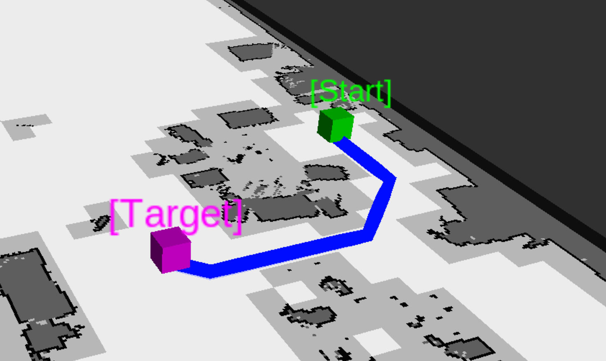
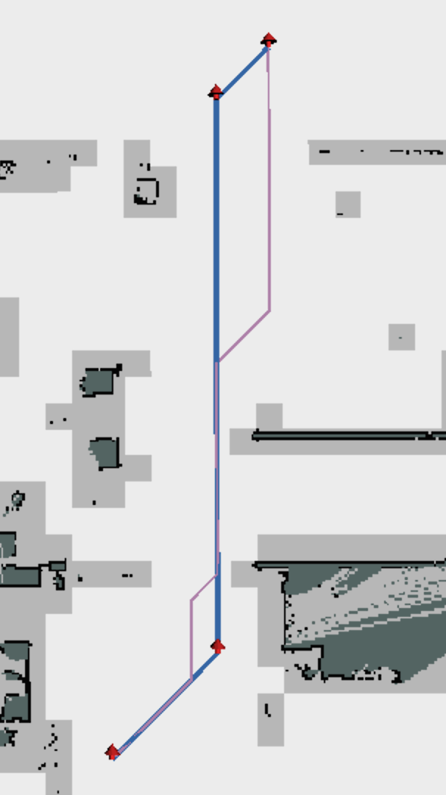
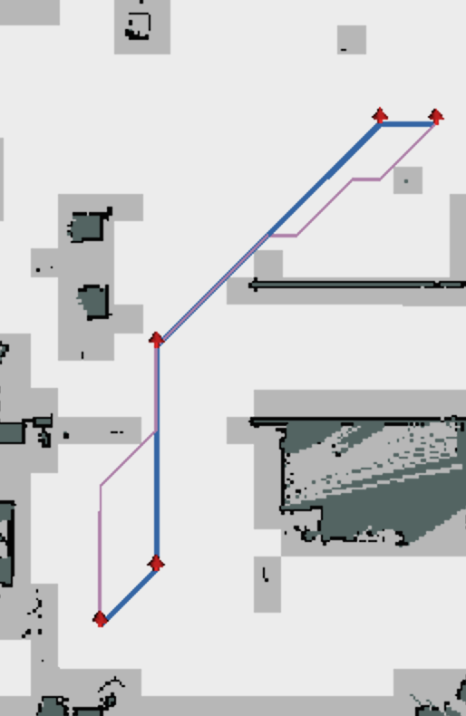
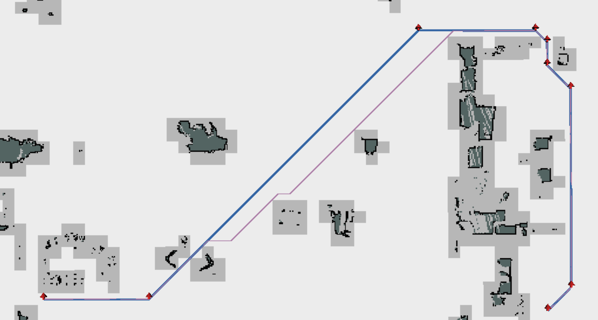

# A-star_Path
  

A*路径算法,C++实现。

-------------------------------------------------------

	2020-1-7	新增优化方法	

-------------------------------------------------------

### 工程应用：

##### A*算法计算路径  

目的：给定起点、终点、栅格地图信息，计算出一条最优的路径。

> 关于返回值bool：A*算法是概率完备的，这里的含义为有路径则返回true，否则返回false。

```c++
bool Path_Calc_Raw(XY_t start,XY_t target,std::vector<signed char> griddata,int gridmap_width,int gridmap_height)
```




##### A*算法计算路径+优化

目的：在路径最优的情况下减少不必要的转向次数

方法：1.更改代价，即改变不同行进方向的代价。

​			2.基于原始路径的优化，分析拐点>路径可行性>占用检查>迭代	（此优化算法采用）

```c++
bool Path_Calc_Optimize(XY_t start,XY_t target,std::vector<signed char> griddata,int gridmap_width,int gridmap_height)
```


&nbsp;&nbsp;&nbsp;&nbsp;&nbsp;&nbsp;&nbsp;&nbsp;&nbsp;&nbsp;&nbsp;&nbsp;&nbsp;&nbsp;&nbsp;&nbsp;



